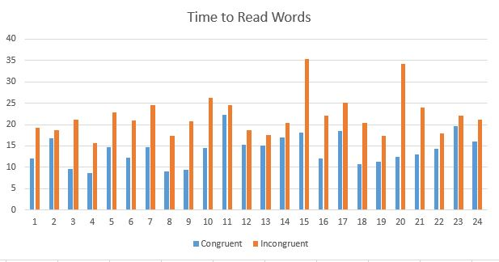
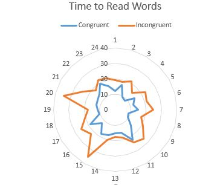

# P1: Test a Perceptual Phenomenon

<h2>Background Information</h2>

In a Stroop task, participants are presented with a list of words, with each word displayed in a color of ink. The participant’s task is to say out loud the color of the ink in which the word is printed. The task has two conditions: a congruent words condition, and an incongruent words condition. In the congruent words condition, the words being displayed are color words whose names match the colors in which they are printed: for example RED, BLUE. In the incongruent words condition, the words displayed are color words whose names do not match the colors in which they are printed: for example PURPLE, ORANGE. In each case, we measure the time it takes to name the ink colors in equally-sized lists. Each participant will go through and record a time from each condition.

<h2>Questions For Investigation</h2>

[Dataset: stroopdata.csv](stroopdata.csv)

<h3> 1. What is our independent variable? What is our dependent variable? </h3>

<b>Independent Variable:</b> Congruent and incongruent words
 
<b>Dependent Variable:</b> Time to name the color

<h3> 2. What is an appropriate set of hypotheses for this task? What kind of statistical test do you expect to perform? Justify your choices.</h3>

<b>Ho (Null Hypothesis):</b> The time required to name the color for congruent word is equal to the time required to name the color of incongruent word. 

<b>Ha (Alternative Hypothesis):</b> The time required to name the color for congruent word is not equal to the time required to name the color of incongruent word. 

<b>I will use a Paired T-Test because: </b>  
 &nbsp; &nbsp; &nbsp; - i don't know the populations standard deviation  
 &nbsp; &nbsp; &nbsp; - i have a limited sample (n < 30)  
 &nbsp; &nbsp; &nbsp; - data is derived from subjects who have been measured at two time points (each individual has two measurements)  
 

<h3>3. Report some descriptive statistics regarding this dataset. Include at least one measure of central tendency and at least one measure of variability.</h3>

<table>
<tr>
<th></th>
<th>Congruent</th>
<th>Incongruent</th>
</tr>
<tr>
<td>Mean</td>
<td>14.05</td>
<td>22.02</td>
</tr>

<tr>
<td>Median</td>
<td>14.36</td>
<td>21.02</td>
</tr>

<tr>
<td>Variance</td>
<td>12.67</td>
<td>23.01</td>
</tr>

<tr>
<td>St. Dev.</td>
<td>3.56</td>
<td>4.80</td>
</tr>

<tr>
<td>St. Err.</td>
<td>0.73</td>
<td>0.98</td>
</tr>

</table>

<h3>
4. Provide one or two visualizations that show the distribution of the sample data. Write one or two sentences noting what you observe about the plot or plots.
</h3>

<table>

<tr>
<td>
   
</td>
<td>
   
</td>
</tr>

</table>

Sources: 
 
<a href="https://classroom.udacity.com/nanodegrees/nd002">Udacity Data Analyst Nanodegree Program Statistics Lessons</a> 
 
http://www.statstutor.ac.uk/resources/uploaded/paired-t-test.pdf
 
https://www.amazon.com/Essentials-Business-Statistics-Bruce-Bowerman/dp/0078020530

